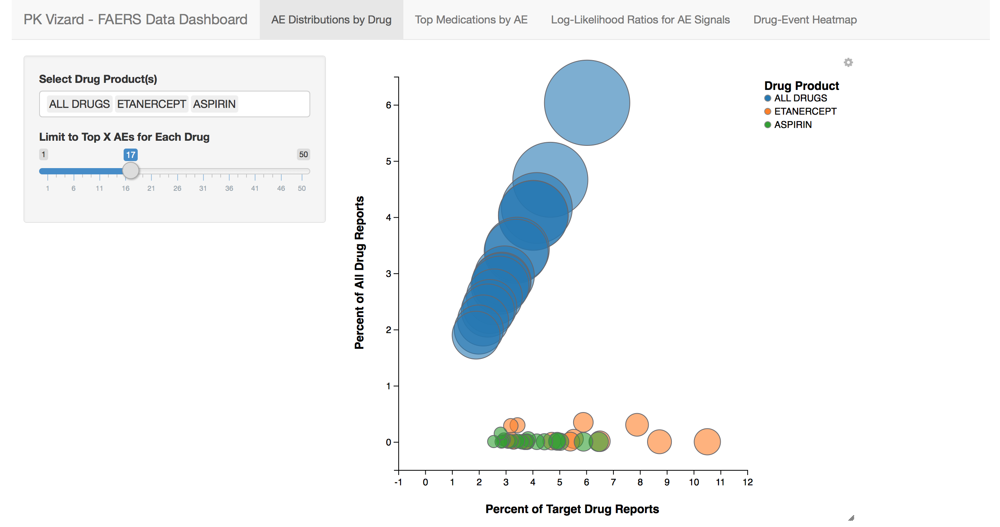
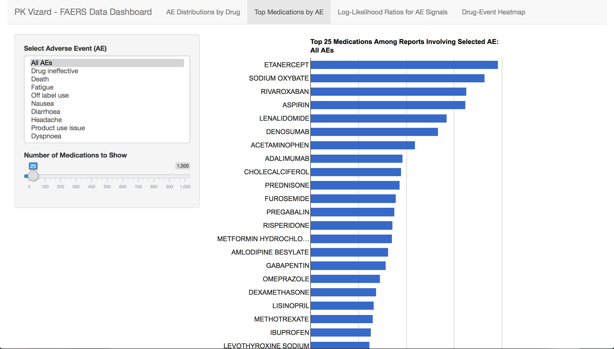
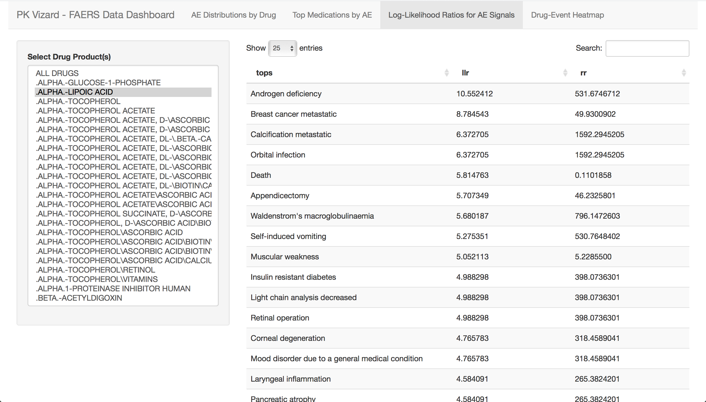
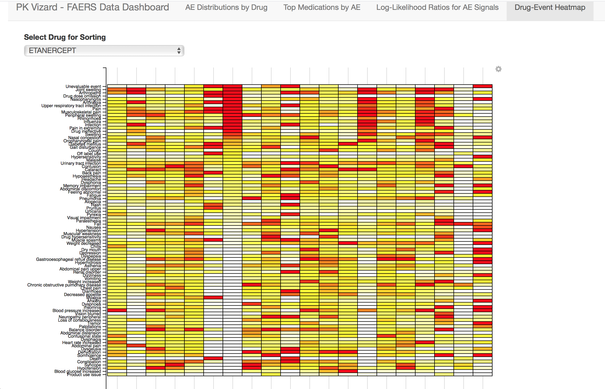

 # Team
 Phil Rotella
 
 Brad Kenstler
 
 # Packages
* `dplyr`
* `googleVis`
* `ggvis`

 # Dataset
 Our dataset for this application comes from the U.S. Food & Drug Administrations open API.
 The data in question is a report of "Analyzed Events" (AE), which are documented complications patients have experienced in relation to some drug.
 The raw events have been binned into 1000 AE categories, such as "Dizziness" or "Loss of libido."
 
 We've taken this data and organized it to various frequencies, including frequency of events for a specific AE or frequency of any event for a specific drug.
 From this we've been able to put together the following application, which looks at the relationships between these two quantities.
 
 # Interface
 
 Our application is a 4-panel visualization of this data.
 

The first panel compares the distributions of AE's for particular drugs against the distribution of AE's for all drugs.

The second panel shows the top Drugs by frequency for a given AE.

The third panel shows a table of AE's for each drug, ranked by the LLR. The LLR is the log-likelihood ratio statistic for that given drug and AE combination. The LLR is a statistic which expresses how many times more likely the observed data is under one model than the other. In our context, we're using it as a measure of how different the AE distribution for a given drug is compared to all drugs; in other words, do these events indicate that this drug is a plausible cause for high occurrences of an AE or is it just a "normal" occurrence.

Our last panel is a heatmap of drug/AE combinations for a subset of drugs. The interface allows you to select which drug to sort the AE's on the y-axis by.

